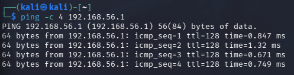
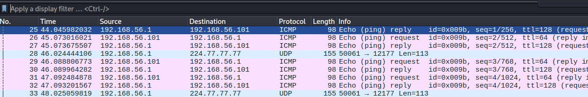
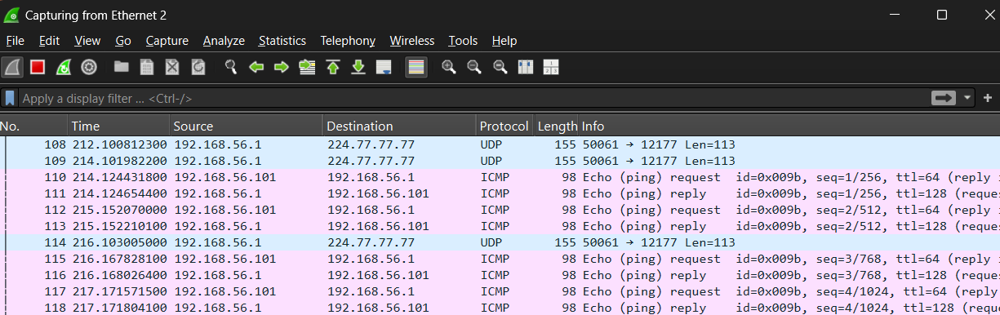
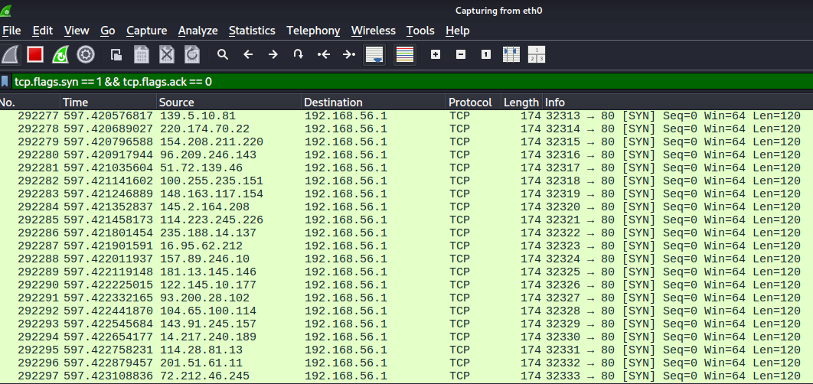
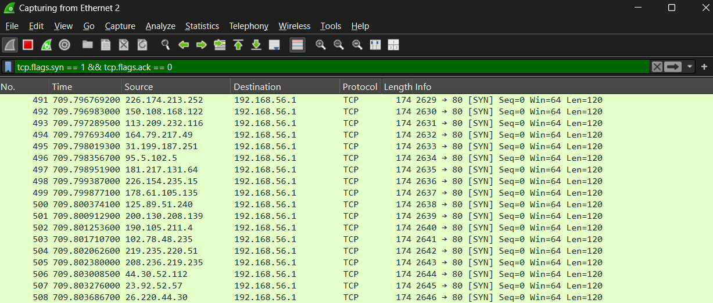
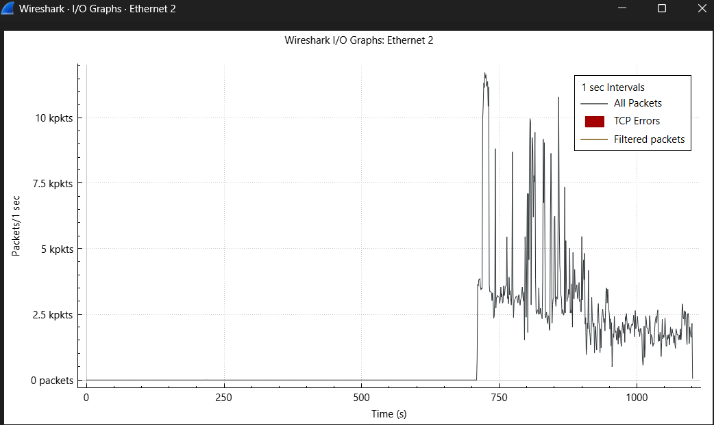
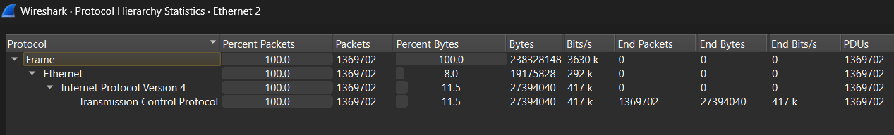

# Tugas KJK - TCP SYN Flood & Detection dengan Wireshark

|Nama|NRP|
|---|---|
|Jonathan Steven Tjahjaputra |5027251036|

## 1. Latar Belakang
TCP menggunakan mekanisme three-way handshake untuk membangun koneksi antara client dan server. Prosesnya dimulai ketika client mengirimkan paket SYN. Server kemudian merespons dengan SYN-ACK, dan client membalas dengan ACK. Setelah tiga tahap tersebut selesai, koneksi TCP dapat digunakan untuk pertukaran data.

TCP SYN Flood memanfaatkan proses tersebut dengan mengirimkan banyak paket SYN ke target. Target akan menganggap paket-paket tersebut sebagai permintaan koneksi dan menyediakan resource untuk menunggu ACK. Jika ACK tidak pernah diterima, koneksi akan tetap berada dalam kondisi half-open. Jika jumlahnya terlalu banyak, resource target dapat terkuras dan layanan menjadi terganggu.


## 2. Set-up Environtment Testing
Pengujian dilakukan menggunakan satu komputer fisik. Kali Linux dijalankan sebagai virtual machine dan digunakan sebagai attacker, sedangkan Windows yang menjadi host digunakan sebagai victim.

Disini, Kedua sistem dihubungkan menggunakan VirtualBox Host-Only Adapter. Kali Linux menggunakan IP `192.168.56.101`, sedangkan Windows menggunakan IP `192.168.56.1`. Dengan konfigurasi tersebut, Kali Linux dapat berkomunikasi langsung dengan Windows melalui jaringan virtual.



Screenshot diatas membuktikan bahwa Attacker dan Victim sudah terhubung.



Diatas adalah bukti bahwa paket berhasil di capture oleh wireshark dari Attacker.



Sementara diatas dari Wireshark sisi Victim..

## 3. Simulasi Serangan TCP SYN Flood
Simulasi dilakukan menggunakan hping3 pada Kali Linux. Tool tersebut digunakan untuk menghasilkan paket TCP SYN dan mengirimkannya menuju target.

### - Menjalankan hping3 (Mulai serangan)
Dengan menggunakan perintah dibawah:

```sh
sudo hping3 -c 15000 -d 120 -S -w 64 -p 80 --flood --rand-source 192.168.56.1
```

Yang berarti mengirimkan 15000 paket dengan payload 120 byte, flag SYN pada header TCP, Ukuran TCP window 64 byte, port 80 (HTTP), secepat mungkin (flood), dan menyamarkan dari sumber alamat IP random (rand-source).

(Dikarenakan screen attacker freeze pada saat laman menampilkan Wireshark, tidak ada rekap screenshot dari eksekusi command line tersebut).

## 4. Capturing Trafik dengan Wireshark

### - Setup Capture Sisi Victim (Windows)
Baseline sebelumnya telah ditampilkan pada saat proses ping untuk pengecekan koneksi. 


### - Setup Capture Sisi Attacker (Kali Linux)
Dengan command line:
```sh
sudo wireshark
```
Pada tab terminal attacker baru, Wireshark akan berjalan. Opsi eth0 dipilih untuk melihat serangan berlangsung.



### - Hasil Capture
Opsi ethernet 2 (tergantung pengguna, pada laptop saya letaknya di ethernet 2) dipilih untuk melihat hasil saat serangan berlangsung. Interface yang digunakan adalah VirtualBox Host-Only Ethernet Adapter karena interface tersebut terhubung dengan Kali Linux.



Dibawah adalah video live capture (Sisi Attacker mengalami freeze)

[Live Capture](assets/livecapt.mp4)

## 5. Analisis Trafik di Wireshark

### - Filter SYN Tanpa ACK (tcp.flags.syn == 1 and tcp.flags.ack == 0)
Dengan menggunakan filter:
```
tcp.flags.syn == 1 and tcp.flags.ack == 0
```
Pada Wireshark.

Filter tersebut akan menampilkan paket yang memiliki flag SYN aktif tetapi flag ACK tidak aktif. Dalam kondisi SYN Flood, jumlah paket yang memenuhi filter ini dapat meningkat secara drastis karena attacker mengirimkan banyak permintaan koneksi.


### - Filter SYN-ACK (tcp.flags.syn == 1 and tcp.flags.ack == 1)
Dengan menggunakan filter:
```
tcp.flags.syn == 1 and tcp.flags.ack == 1
```
Pada Wireshark.

SYN-ACK merupakan respons dari target terhadap paket SYN yang diterima. Ketika digunakan IP spoofing, target mengirimkan SYN-ACK menuju alamat IP sumber yang tercantum pada paket SYN. Karena alamat tersebut dapat merupakan alamat palsu, respons tersebut tidak kembali kepada attacker sebenarnya.

Akibatnya, proses three-way handshake tidak selesai dan koneksi tetap berada dalam kondisi half-open.

### - Statistik I/O Graph
I/O Graph digunakan untuk melihat perubahan jumlah paket terhadap waktu. Ketika SYN Flood berlangsung, grafik menunjukkan peningkatan trafik yang sangat tinggi karena banyak paket SYN dikirim dalam waktu singkat.

Setelah serangan dihentikan, jumlah trafik akan mengalami penurunan. Lonjakan trafik yang sangat tinggi dalam waktu singkat dapat menjadi salah satu indikasi adanya serangan SYN Flood



### - Statistik Protocol Hierarchy
Protocol Hierarchy digunakan untuk melihat distribusi protokol dalam hasil capture. Pada hasil pengujian SYN Flood, trafik TCP dapat mendominasi jumlah paket karena sebagian besar paket yang dikirim merupakan paket TCP SYN.

Informasi ini dapat digunakan sebagai data pendukung untuk mengetahui karakteristik trafik selama serangan berlangsung.



## 6. Diskusi dan Interpretasi

### Gejala Khas Serangan SYN Flood Berdasarkan Hasil Capture

Berdasarkan hasil capture, terdapat beberapa karakteristik yang menunjukkan adanya serangan TCP SYN Flood. Pertama, terlihat peningkatan jumlah paket TCP secara tiba-tiba dengan puncak sekitar 28.000 paket per detik pada I/O Graph. Kedua, paket yang diterima memiliki flag SYN aktif dengan nilai Seq=0, Win=64, dan Len=120 yang relatif seragam. Keseragaman tersebut menunjukkan bahwa paket dihasilkan secara otomatis menggunakan tool.

Selain itu, alamat IP sumber terlihat berubah-ubah secara acak sehingga tidak terdapat satu sumber IP yang dominan. Dominasi protokol TCP yang mencapai hampir seluruh trafik juga menjadi anomali dibandingkan kondisi jaringan normal. Kombinasi karakteristik tersebut menjadi indikator kuat adanya aktivitas SYN Flood.

### Mengapa Jumlah SYN-ACK Tetap Nol Meskipun SYN Sangat Banyak

Berdasarkan filter `tcp.flags.syn == 1 and tcp.flags.ack == 1`, tidak ditemukan paket SYN-ACK pada hasil capture. Kondisi ini berkaitan dengan penggunaan parameter `--rand-source` yang membuat paket SYN menggunakan alamat IP sumber secara acak atau spoofed.

Ketika target menerima paket SYN, target akan mengirimkan SYN-ACK menuju alamat IP yang tercantum sebagai sumber paket. Karena alamat tersebut merupakan alamat yang dipalsukan, respons SYN-ACK tidak kembali kepada attacker sebenarnya. Akibatnya, proses three-way handshake tidak dapat diselesaikan.

Target kemudian tetap mempertahankan koneksi dalam kondisi half-open sambil menunggu ACK. Apabila jumlah koneksi yang belum selesai terus bertambah, kapasitas antrian koneksi dapat semakin terbebani dan pada akhirnya menghabiskan resource yang tersedia.

### Dampak IP Spoofing Terhadap Deteksi dan Mitigasi

Penggunaan IP spoofing melalui parameter `--rand-source` membuat proses identifikasi sumber serangan menjadi lebih sulit. Setiap paket dapat memiliki alamat IP sumber yang berbeda sehingga administrator tidak dapat dengan mudah menentukan satu alamat IP sebagai sumber utama serangan.

Kondisi tersebut juga membuat metode mitigasi yang hanya mengandalkan pemblokiran alamat IP menjadi kurang efektif. Oleh karena itu, pendeteksian dan mitigasi perlu mempertimbangkan karakteristik trafik lainnya, seperti jumlah paket SYN, kecepatan pengiriman paket, rasio SYN terhadap ACK, serta pola distribusi koneksi.

---

## 7. Refleksi dan Perlindungan

### Refleksi

Praktikum ini memberikan pemahaman secara langsung mengenai mekanisme TCP SYN Flood dan dampaknya terhadap ketersediaan layanan jaringan. Serangan memanfaatkan proses three-way handshake TCP dengan mengirimkan sejumlah besar permintaan SYN yang menyebabkan target harus menangani banyak koneksi yang belum selesai.

Penggunaan IP spoofing semakin mempersulit proses identifikasi sumber serangan. Dari sisi deteksi, Wireshark dapat digunakan untuk mengamati berbagai anomali trafik, seperti peningkatan jumlah paket SYN, tidak ditemukannya SYN-ACK, serta dominasi protokol TCP yang sangat tinggi.

Hasil tersebut menunjukkan bahwa analisis paket dan pola trafik dapat membantu mengidentifikasi karakteristik serangan SYN Flood pada jaringan.

### Teknik Mitigasi

Beberapa teknik yang dapat digunakan untuk mengurangi dampak serangan TCP SYN Flood antara lain:

1. **SYN Cookies**  
   SYN Cookies digunakan untuk mengurangi penggunaan resource ketika server menerima permintaan SYN. Informasi koneksi dapat direpresentasikan melalui sequence number sehingga resource koneksi tidak perlu dialokasikan secara penuh sebelum ACK yang valid diterima. Dengan demikian, serangan terhadap antrian koneksi dapat dikurangi.

2. **Backlog Queue Tuning**  
   Teknik ini dilakukan dengan meningkatkan kapasitas antrian untuk koneksi yang masih berada dalam kondisi half-open. Dengan kapasitas yang lebih besar, server dapat menangani lebih banyak permintaan koneksi yang belum selesai. Namun, metode ini memiliki keterbatasan dan tidak selalu cukup untuk menghadapi serangan dengan volume yang sangat tinggi.

3. **Firewall dan Rate Limiting**  
   Firewall dan mekanisme rate limiting dapat digunakan untuk membatasi jumlah paket SYN yang masuk dalam periode tertentu. Meskipun penggunaan IP spoofing membuat pemblokiran berdasarkan alamat IP menjadi lebih sulit, pembatasan berdasarkan pola dan laju trafik dapat membantu mengurangi jumlah trafik yang mencurigakan.

4. **Intrusion Prevention System (IPS)**  
   IPS melakukan pemeriksaan trafik secara real-time untuk mencari pola yang menunjukkan aktivitas serangan. Ketika karakteristik SYN Flood terdeteksi, IPS dapat mengambil tindakan untuk membatasi atau memblokir trafik yang dianggap berbahaya.

5. **Upstream Filtering dan Anycast**  
   Upstream filtering dan Anycast dapat digunakan untuk menangani serangan pada tingkat infrastruktur jaringan yang lebih luas. Trafik berbahaya dapat disaring atau didistribusikan sebelum mencapai server utama. Pendekatan seperti ini umumnya digunakan untuk menghadapi serangan dengan volume besar yang sulit ditangani hanya menggunakan mekanisme mitigasi pada host.

## Kesimpulan

Praktikum ini berhasil menunjukkan mekanisme TCP SYN Flood menggunakan `hping3` pada lingkungan virtualisasi yang terkontrol. Serangan menghasilkan trafik SYN dalam jumlah sangat besar dengan alamat IP sumber yang berubah-ubah, sehingga target menerima banyak permintaan koneksi yang tidak menyelesaikan proses three-way handshake.

Hasil capture menggunakan Wireshark menunjukkan beberapa karakteristik utama, seperti lonjakan trafik hingga sekitar 28.000 paket per detik, dominasi paket SYN, penggunaan IP sumber yang berubah-ubah, serta tidak ditemukannya paket SYN-ACK pada filter yang digunakan.

Melalui penggunaan filter paket, I/O Graph, dan Protocol Hierarchy, karakteristik serangan dapat diamati dan dianalisis dengan lebih jelas. Pemahaman terhadap pola tersebut dapat menjadi dasar dalam melakukan deteksi serta menentukan metode mitigasi yang sesuai terhadap serangan TCP SYN Flood.